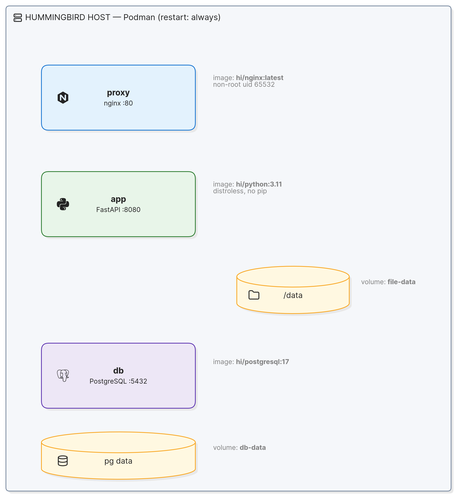
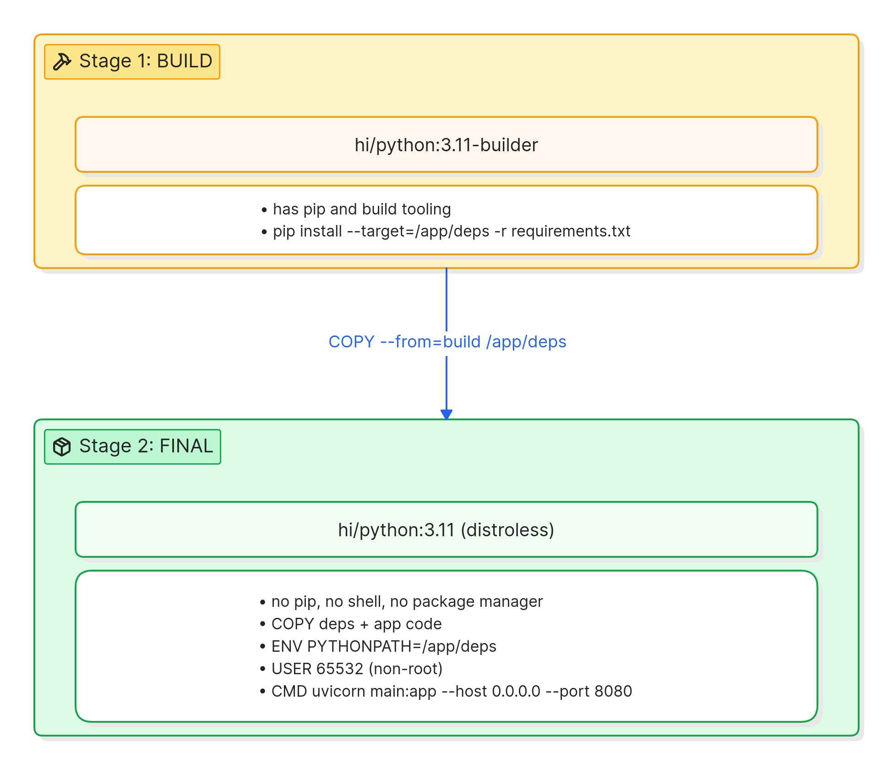

# Architecture: Running a Real Application on Fedora Hummingbird Linux

**Audience:** Engineering managers and engineers
**Reference application:** File Drop (FastAPI + nginx + PostgreSQL), in this folder
**Status:** Architecture baseline for new apps targeting Hummingbird

---

## 1. Context

We run a small, internet-facing service that must stay up 24/7, stay patched, and carry as few known security bugs as possible. This project answers three questions about Fedora Hummingbird Linux:

1. **How is the near-zero CVE goal implemented?** — Through Hummingbird's distroless `hi/*` container images, multi-stage builds, and the disciplines they enforce (Sections 4, 6).
2. **What is the impact of using external container repositories?** — A companion project ([filedrop-unhardened](https://github.com/Brillar0101/filedrop-unhardened)) deploys the same app on the same Hummingbird host using standard Docker Hub images. See its `COMPARISON.md` for the side-by-side analysis.
3. **How does Fedora Hummingbird Linux protect you regardless?** — The host OS provides an immutable root filesystem, atomic updates via `bootc`, instant rollback, and no host-level package manager. These protections apply whether containers are hardened or not (Section 6).

The reference workload is **File Drop**: a file-upload service. A user uploads a file through a web page or the command line and gets back a download link. It is deliberately ordinary — a web app, a reverse proxy, a database, and a place to store files — so the architecture generalizes to most line-of-business services.

**Goals**

- **Near-zero CVEs** — distroless images with minimal packages, verified by scanning.
- **Secure by default** — non-root containers, read-only root filesystem, no shell or package manager.
- **Consistent** — the same image runs in dev, test, and production, with no per-machine drift.
- **Always on** — survives crashes and reboots, and can be patched and rolled back without long outages.

**Non-goals**

- Supporting software that has no Hummingbird image (e.g. MySQL — see Section 8).
- Mutating live machines by hand (installing packages, editing config on a running host).
- Running monitoring or security tools that expect to modify the host OS in place.

---

## 2. Logical Components

Four logical components, each mapped to a specific Hummingbird image. Image tags below were verified against the live registry.

| Component | Responsibility | Hummingbird image | Verified |
|-----------|----------------|-------------------|----------|
| **App** | Business logic + web UI (FastAPI on Uvicorn) | built on `hi/python:3.11` (+ `hi/python:3.11-builder` for deps) | Yes |
| **Web / Proxy** | Front door: TLS termination, reverse proxy, upload size limits | `hi/nginx:latest` | Yes |
| **Database** | Stores file metadata (who, what, when, link) | `hi/postgresql:17` | Yes (`:16` does NOT exist) |
| **File storage** | Holds the actual uploaded bytes | mounted volume at `/data` | n/a (volume) |
| **DB storage** | Holds Postgres data files | mounted volume at `/var/lib/postgresql/data` | n/a (volume) |

Key principle: **the app image carries no package manager.** Dependencies are baked in at build time via a multi-stage build (Section 4). At runtime there is no `pip`, no shell, no way to add software. State lives only in volumes; everything else is immutable.

This maps directly to the existing `compose.yaml`: three services (`db`, `app`, `proxy`) and two named volumes (`db-data`, `file-data`).

---

## 3. Deployment Topology

The default and recommended topology is **three containers on one Hummingbird host**, orchestrated by Podman (via `podman-compose`). The same images can also run inside a Hummingbird VM or on bare metal — the container layout is identical in all three because they share the same OCI images.



**Traffic flow:** client -> host port 8080 -> nginx (`proxy`) -> `app:8080` (Uvicorn) -> Postgres (`db:5432`) for metadata and the `/data` volume for file bytes.

**Run modes:**

- **Container** — Podman on an existing Linux host. Simplest; what `compose.yaml` targets directly.
- **VM** — Build a bootable qcow2 with `bootc-image-builder`, boot under KVM/libvirt. Best for evaluation and snapshot/throwaway testing.
- **Bare metal / full server** — Write the bootc image to a disk (`bootc install to-disk` or `dd` of a raw image). Production on dedicated hardware, with `bootc` managing the whole OS.

The progression is intentional: prove the app in a **container**, validate the whole OS in a **VM**, then promote to **bare metal**. Because every mode uses the same images, what you verify in one carries over.

---

## 4. Build Pipeline

The central technique is the **multi-stage build** (`Containerfile`). It is what lets a real framework like FastAPI run on a distroless image that has no package manager — and it is the primary mechanism behind the near-zero CVE count.



The builder stage has everything needed to compile and install Python packages. The final stage has nothing except the runtime and the installed dependencies. Build tools, `pip`, and the shell all stay behind in the builder stage. This is the core reason the final image has so few CVEs: there is almost nothing in it to be vulnerable.

**Full pipeline, build to deploy:**

1. **Build** — `podman build -t filedrop_app:latest .` Dependencies are resolved in the builder stage and copied into the distroless final image.
2. **Scan** — `grype filedrop_app:latest`. Scan the image and verify the CVE count before promoting it. This is the gate that verifies the near-zero CVE claim — run it and see the actual number.
3. **Sign** (recommended) — `cosign sign` the image and optionally attach the SBOM and scan results as signed attestations. Downstream hosts can verify the signature before running.
4. **Publish** — push the signed image to your registry.
5. **Deploy** — on the Hummingbird host, `podman-compose up -d` pulls the images and starts all services with `restart: always`.

```
  build (multi-stage) --> grype scan --> cosign sign --> push --> deploy (podman-compose up -d)
         |                    |               |                         |
   no pip in final      gate on CVEs    provenance/SBOM          restart: always (24/7)
```

The base OS itself (for VM/bare-metal) follows the same image discipline: it is built with `bootc-image-builder` and updated as a whole image, never patched file-by-file.

---

## 5. Data, State, Networking, and Updates

### Data and state

The root filesystem of every image is **read-only and immutable**. Writable state is confined to mounted volumes:

| What | Where | Volume |
|------|-------|--------|
| Uploaded files | `/data` in the `app` container | `file-data` |
| Database files | `/var/lib/postgresql/data` in `db` | `db-data` |
| Proxy config | `/etc/nginx/nginx.conf` (mounted read-only) | bind mount `:ro` |

This is the core safety property: the `app` accepts files from untrusted users all day, but those bytes land in the `/data` **volume**, never on the sealed root. Rebuilding or updating the image does not touch the volumes — data survives upgrades, rollbacks, and reboots. On the host OS, additional mutable areas are limited to `/var` and `/etc`; the rest of the OS is sealed.

### Networking

- nginx is the only component that publishes a host port (`8090:8080`). App and DB are reached only over Podman's internal network by service name (`app:8080`, `db:5432`) and are not exposed externally.
- nginx terminates client connections, enforces `client_max_body_size 50m`, and reverse-proxies to the app. TLS termination belongs here in production (mount certs read-only; do not bake them into the image).
- The app reaches Postgres via `DATABASE_URL`. Secrets (DB password) come from the environment / a secret store, never hardcoded in an image. The sample compose uses a plaintext password for demo only — replace with injected secrets before production.

### Updates and rollback (bootc)

For VM and bare-metal hosts, the OS is managed as an image, not as a set of files:

```
  sudo bootc status     # what image is currently running
  sudo bootc upgrade    # pull + stage the next image version (atomic)
  sudo bootc rollback   # revert to the previous known-good image
```

Updates are **atomic** — they fully apply or not at all, never leaving a half-patched machine. **Rollback** is an instant switch back to the last working image. Application containers update the same way conceptually: build a new image, scan it, deploy it; if it misbehaves, redeploy the previous tag. Volumes are untouched throughout, so data is never at risk during an update.

---

## 6. Security Model

Defense in depth, with layers at both the **container level** and the **host OS level**.

### Container-level protections (from Hummingbird images)

These protections come from using `hi/*` images and the multi-stage build discipline:

1. **Distroless** — the runtime image contains only the app and its dependencies. No shell, no package manager, no general-purpose tools. Fewer packages means fewer CVEs and a smaller attack surface.
2. **Non-root (UID 65532)** — every component runs as an unprivileged user. A compromised process has no root on the host.
3. **Immutable, read-only root** — the running container filesystem cannot be modified. No quiet file edits, no drive-by package installs, no configuration drift.
4. **Near-zero CVEs, verified** — images include very little and are scanned (`grype`) before promotion. This is a measured property, verified on every build, not a one-time claim.

### Host OS-level protections (from Fedora Hummingbird Linux)

These protections come from the Hummingbird host OS itself and apply regardless of what container images run inside:

1. **Immutable host root filesystem** — the host OS root is read-only. Even if an attacker escapes a container, they cannot modify the host OS, install rootkits, or create persistence.
2. **Atomic OS updates (bootc)** — the host updates as a whole image. No partial patches, no inconsistent state, no drift between machines.
3. **Instant rollback** — `bootc rollback` reverts to the previous known-good OS image. Critical for always-on services.
4. **No host-level package manager** — you cannot `dnf install` on a running Hummingbird host. The host is image-based; what ships in the image is what runs.
5. **Network minimization** — only the proxy is exposed; app and database stay on the internal network. This is a deployment choice enforced by the compose/podman configuration.

### What breaks the promise (call these out in review)

- **Installing extra packages at runtime** — impossible by design, and pulling outside software back in re-introduces CVEs. If you need something, build it into a fresh, scanned image instead.
- **Adding software with unknown provenance** in the builder stage — scan the result, or you have silently widened the attack surface.
- **Running as root** or mounting volumes with broad write access undermines the non-root and read-only guarantees.
- **Baking secrets or certs into images** — these belong in injected environment/secret stores and read-only mounts.
- **Treating volumes as trusted** — `/data` holds untrusted uploads; the app must still validate input, enforce size/type limits, and never execute uploaded content.

---

## 7. Scaling Approach

Scaling is horizontal and drift-free because every host runs the **exact same image**.

- **More throughput, same host** — run additional `app` replicas behind nginx (nginx `upstream` already fronts the app; add servers to the upstream pool). The app is stateless: file bytes go to the shared `/data` volume and metadata to Postgres, so replicas are interchangeable.
- **More hosts** — deploy the same images to many Hummingbird hosts behind a load balancer. Because images are immutable and identical, there is no per-machine drift: host #1 and host #100 are byte-for-byte the same. This is the central operational win over hand-built servers.
- **Shared state as you grow** — the single-host volume model (one `/data`, one Postgres) is the first bottleneck when you go multi-host. The path forward: move uploads to shared/object storage and run Postgres as a dedicated, replicated service (or managed database) that all app hosts connect to. The app and proxy tiers stay stateless and scale freely; the data tier is scaled separately.
- **Patching at scale** — `bootc upgrade` rolls a new OS image across the fleet atomically, with `bootc rollback` as the safety net. The same image everywhere means one validated update applies uniformly.

---

## 8. Key Decisions, Trade-offs, and Honest Limitations

### ADR-1: PostgreSQL, not MySQL

- **Context:** App needs a relational database.
- **Decision:** Use `hi/postgresql:17`.
- **Why:** There is **no `hi/mysql` image** in the Hummingbird catalog. PostgreSQL is the supported relational database with a verified image (`:17` or `:latest`; note `:16` does not exist).
- **Trade-off / limitation:** If a team standard mandates MySQL, there is no Hummingbird image for it. You would either port to PostgreSQL, or run MySQL from an external repository and accept that it will not carry the near-zero CVE benefit. The companion project ([filedrop-unhardened](https://github.com/Brillar0101/filedrop-unhardened)) demonstrates this scenario.

### ADR-2: Multi-stage build instead of a runtime package manager

- **Decision:** Install dependencies in `hi/python:3.11-builder`, copy into distroless `hi/python:3.11`.
- **Pros:** Keeps the final image distroless and low-CVE; reproducible; no `pip` at runtime to exploit.
- **Cons:** Every dependency change requires a rebuild + rescan + redeploy — no hotfixing a live container. This is the intended discipline, but teams used to `pip install` on a server must adjust.

### ADR-3: nginx as the only exposed component

- **Decision:** Publish only the proxy port; keep app and DB internal.
- **Pros:** Single ingress point, central place for TLS, rate limits, and request size caps (`client_max_body_size 50m`).
- **Cons:** nginx is a single point of failure on one host; in a fleet, put a load balancer in front and run nginx per host.

### ADR-4: Container-first, with a VM -> bare-metal promotion path

- **Decision:** Default to containers via `compose.yaml`; offer VM and bare-metal using the same images.
- **Pros:** Fastest start, identical images across all modes, safe evaluation in a throwaway VM before committing hardware.
- **Cons:** Bare-metal/VM steps depend on newer `bootc` tooling; confirm exact commands against current docs and test on spare hardware first.

### Honest limitations to plan around

- **Debugging is different.** No shell in the image means you cannot `exec` in and poke around the normal way. You debug by attaching a **temporary helper/sidecar container** that has tools, used only when needed and never baked into the production image. Train the team on this before go-live.
- **Monitoring/security agents that modify the host won't work.** Anything that expects to install itself onto the OS or write to the root filesystem is incompatible. Use **sidecar containers** or agentless/remote collection, and read metrics/logs over the network instead of from inside the sealed image.
- **No live patching.** Every change — app dependency or OS — is a new image: build, scan, deploy. Faster mean-time-to-deploy, but no quick in-place edits.
- **Single-host state is the scaling ceiling.** The shared `/data` volume and single Postgres must become shared/object storage and a replicated database before true multi-host scale-out.
- **Hummingbird is new.** Container image tags here are verified against the live registry; the `bootc` VM/bare-metal commands use standard tooling but should be confirmed against current docs before production.

---

## Summary

Fedora Hummingbird Linux delivers near-zero CVEs through two layers of protection. At the **container level**, distroless `hi/*` images strip out everything the app doesn't need — no shell, no package manager, no unused system libraries — so there is almost nothing left to be vulnerable. At the **host OS level**, the immutable root filesystem, atomic updates via `bootc`, instant rollback, and the absence of a host-level package manager protect the system regardless of what containers run inside.

The reference File Drop app (this folder) shows the container-level pattern end to end: a multi-stage build onto `hi/python`, fronted by `hi/nginx`, backed by `hi/postgresql:17`, with all untrusted and durable state confined to volumes. The price of admission is discipline — build-don't-patch, PostgreSQL not MySQL, sidecar-based debugging and monitoring — and those constraints are exactly what deliver the security and consistency.

## Relevant files

- `Containerfile` — multi-stage build (the core technique)
- `compose.yaml` — three-service topology + volumes, `restart: always`
- `nginx.conf` — reverse proxy, upload size limit, security headers
- `app/main.py` — the FastAPI app (pooled DB, streamed uploads, escaped output)
- `deploy/` — provision a Hummingbird VM and deploy the stack on it
- `README.md` — stack overview, verified image tags, MySQL-absent note
