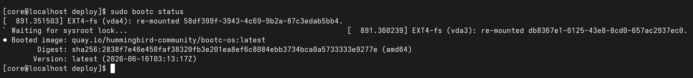
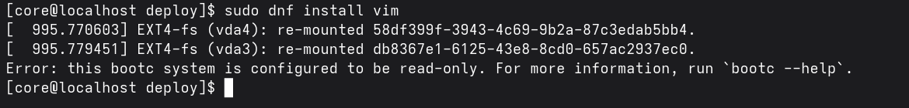
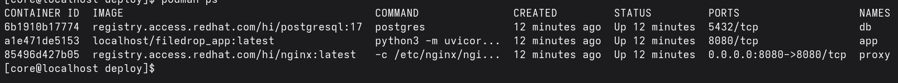
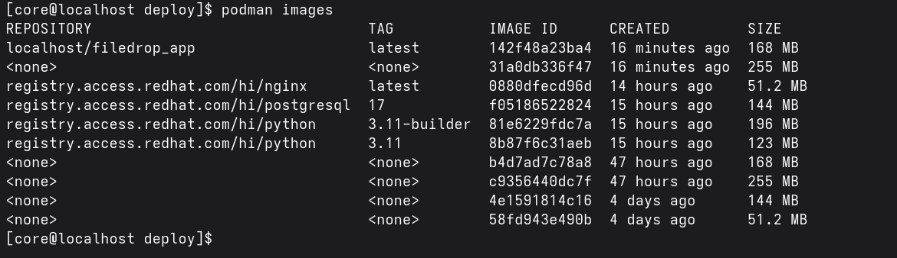
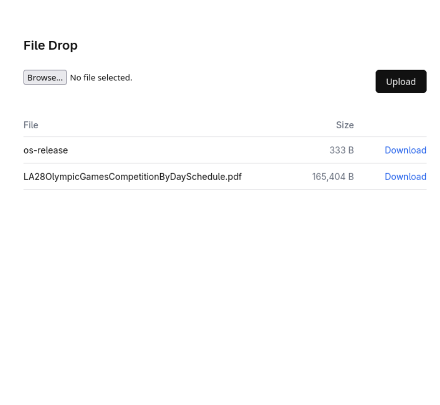
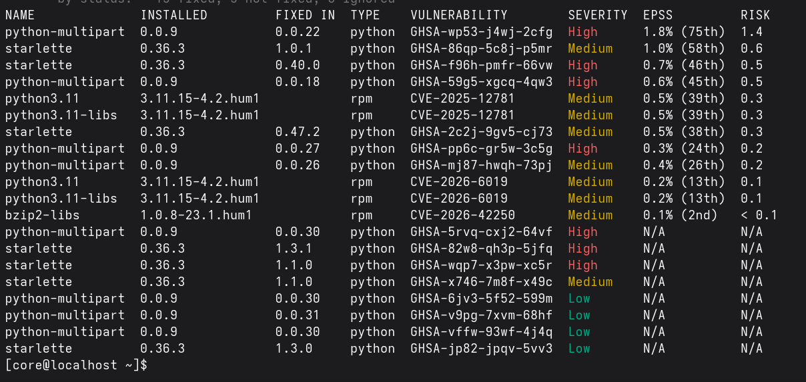

# File Drop — Why Fedora Hummingbird Linux for an Always-On Upload Server

## The project

**File Drop** is a small upload service with a real, industry-standard stack:

- A **FastAPI** app (served by Uvicorn) with a clean web page to upload and download files.
- **nginx** in front of it.
- **PostgreSQL** to hold the file details.
- A command-line client for uploads from a terminal.

The server runs on **Fedora Hummingbird Linux** and must stay up **24 hours a day**, taking files from the internet. The goal is an always-on server with the smallest attack surface possible.

This guide is about *why the server should run on Hummingbird* — and how Hummingbird changes the way you deploy compared to traditional Fedora.

---

## How Fedora Hummingbird differs from traditional Fedora

On a traditional Fedora server, you set up your stack by installing packages and pulling container images directly:

```bash
# Traditional Fedora — install packages on the host
sudo dnf install nginx postgresql-server python3-pip
pip install fastapi uvicorn
sudo systemctl enable --now nginx postgresql

# Or pull whatever container images you want
podman pull docker.io/library/node:22
podman pull docker.io/library/mysql:8
```

You can install anything, modify any file, and the system accumulates packages, configs, and drift over time. Every package you install — and every package it depends on — is a potential CVE source.

On **Fedora Hummingbird Linux**, this model is fundamentally different:

```bash
# Hummingbird — these commands do NOT work
sudo dnf install nginx                # blocked: root filesystem is read-only
pip install fastapi                   # blocked: no pip on the host
sudo vi /etc/some-config             # blocked: root filesystem is immutable

# Instead, everything runs as container images
podman pull registry.access.redhat.com/hi/nginx:latest
podman pull registry.access.redhat.com/hi/postgresql:17

# The host OS itself updates as a whole image
sudo bootc upgrade                   # pull the next OS image (atomic)
sudo bootc rollback                  # revert if it breaks
```

The host OS is **read-only and image-based**. You do not install packages on it. You do not edit config files on it. You run your workload as containers, using images from the Hummingbird catalog (`hi/*`). The OS updates atomically as a versioned image, not file-by-file.

This is what it looks like in practice. The `bootc status` command confirms the VM is running the Hummingbird OS image:



And when you try to install a package with `dnf`, the system refuses — the root filesystem is read-only:



---

## Running a real framework on a distroless image

The one thing people worry about: distroless images have no `pip`, so how do you run FastAPI? The answer is a **multi-stage build** (see `Containerfile`): install the dependencies in a builder stage, then copy them into the final distroless image. The framework runs, and the final image still has no shell and no package manager.

```
Builder (hi/python:3.11-builder)  →  pip install --target=/app/deps
                                      ↓ COPY deps only
Final (hi/python:3.11, distroless) →  app code + deps, nothing else
```

This is the part worth showing in a demo, because it proves a real stack works here, not just toy code.

---

## Why Hummingbird is the best fit

**1. Near-zero CVEs = fewer ways in.** The server is exposed all day and handling untrusted files. Distroless Hummingbird images contain only the runtime and your app — no unused packages means fewer known vulnerabilities. Scan the image with `grype` to verify.

**2. Distroless = nothing useful for an attacker.** No shell, no package manager. If someone gains code execution inside a container, there are no tools waiting to help them go further.

**3. Immutable root = the system cannot be changed.** The OS is read-only. On a traditional Fedora server, a compromised process could modify system binaries, install a rootkit, or edit configs. On Hummingbird, the root is sealed. Uploaded files go to a mounted volume (`/data`), so you accept untrusted files while the system itself stays locked.

**4. Atomic updates with rollback = patch without downtime.** On traditional Fedora, `dnf update` modifies files in place — if it fails partway, you have an inconsistent system. On Hummingbird, `bootc upgrade` stages a complete new OS image. It either applies fully or not at all. And `bootc rollback` instantly reverts if something breaks. You stay patched and you stay up.

---

## The demo

After deploying the stack on a Hummingbird VM (see `deploy/README.md`), three containers are running — all on Hummingbird `hi/*` images:



Notice the image sizes — the distroless Hummingbird images are small because they carry only what the app needs:



Open the browser and the File Drop UI is live — upload a file and get a download link:



**The proof — scan the image:**

```bash
grype filedrop_app:latest
```



The near-zero CVE claim is verified by scanning, not taken on faith. The vulnerabilities that do appear come from the Python dependencies, not from unused OS packages — because there are no unused OS packages.

**The comparison:** A companion project ([filedrop-unhardened](https://github.com/Brillar0101/filedrop-unhardened)) runs the same app on the same Hummingbird host, but using standard Docker Hub images (node:22, httpd, mysql:8). Scan that image too and compare the CVE counts. The difference comes from the base images, not the application code.

---

## The takeaway

On a traditional Fedora server, you install packages, pull whatever images you want, and the system accumulates software and CVEs over time. Fedora Hummingbird Linux replaces that model with an immutable, image-based OS where workloads run as containers built on distroless `hi/*` images. The result: near-zero CVEs in the container images, a sealed host OS that cannot be modified, and atomic updates with instant rollback. For an always-on Linux server that takes files from the internet, that is the best fit.
